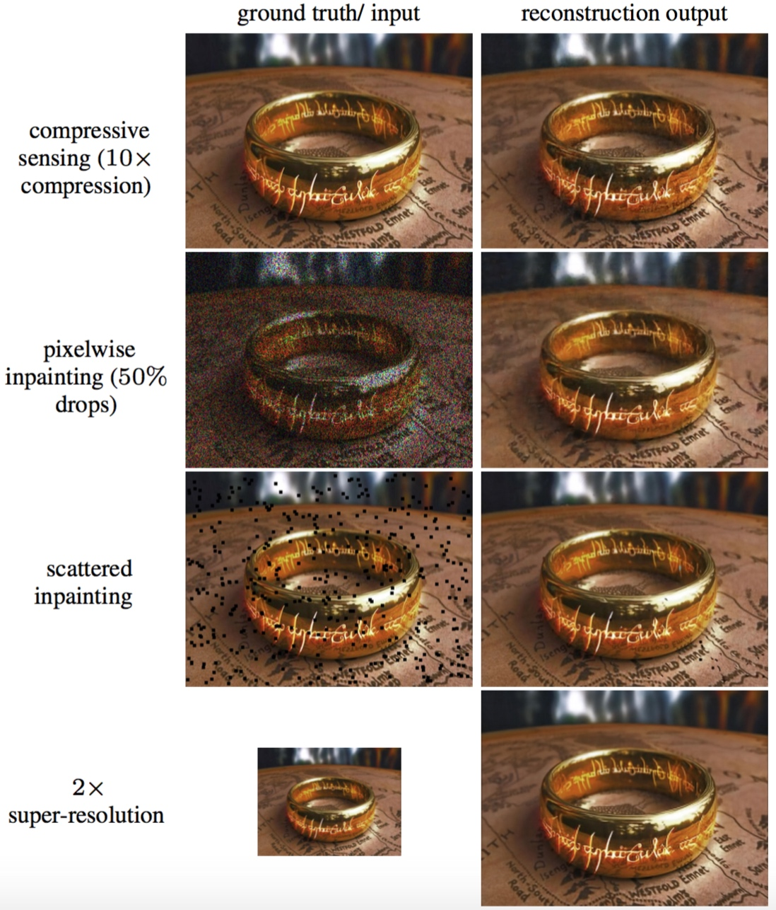
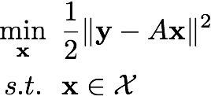
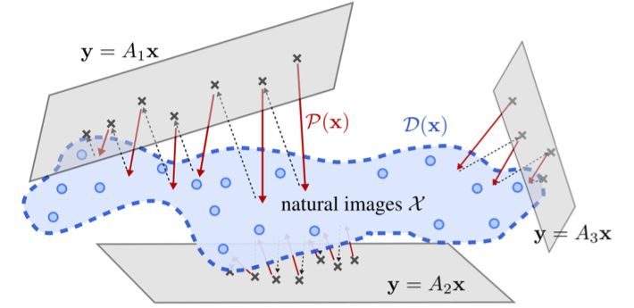
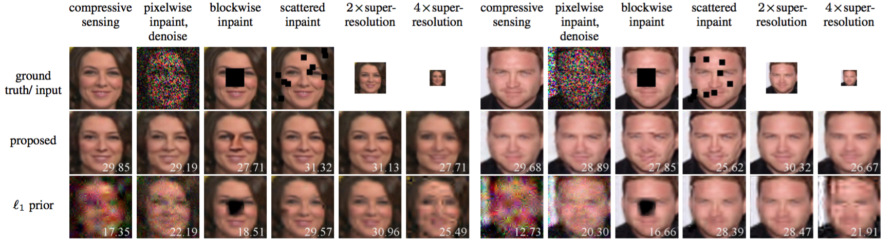

# One-Network-to-Solve-Them-All
It is a Tensorflow implementation of our paper <a href="https://arxiv.org/abs/1703.09912" >One Network to Solve Them All --- Solving Linear Inverse Problems using Deep Projection Models</a>. If you find our paper or implementation useful in your research, please cite:

<table width="50%" border="0" cellspacing="15" cellpadding="0">
<tbody>
<tr>
<td>
<pre>			
@article{chang2017projector,
    title={One Network to Solve Them All --- 
        Solving Linear Inverse Problems using Deep Projection Models},
    author={J. H. Rick Chang and 
        Chun-Liang Li and 
        Barnab{\'a}s P{\'o}czos and 
        B. V. K. Vijaya Kumar and 
        Aswin C. Sankaranarayanan},
    journal={arXiv preprint arXiv:1703.09912},
    year={2017}
}
</pre>
</td>
<td width="450"><a></a></td>
</tr>
</tbody>
</table>

## Brief introduction
The goal of the proposed framework is to solve linear inverse problems of the following form:<br>
&emsp;  <br> where <b><i>y</i></b> is the linear measurements, e.g., a low-resolution image, <b><i>A</i></b> is the linear operator that generates <b><i>y</i></b> from an image <b><i>x</i></b>.  In image super-resolution, <b><i>A</i></b> can indicate direct downsampling or box averaging.  The optimization problem is solved with a constraint that the solution <b><i>x</i></b> lies in the natural image set <i>X</i>.  

To solve the optimization problem, we found that in proximal algorithms like alternating direction method of multipliers (ADMM), the constraint usually appears in solving a subproblem --- projecting current estimate of <b><i>x</i></b> to the set <i>X</i>. Thereby, we propose to learn the projection operator with a deep neural net. Since the projection opereator is <em>independent</em> to individual linear operator <i>A</i>, once the network is trained, it can be used in <em>any</em> linear inverse problem.  Since we do not have the exaxt definition of the natural image set, we use the decision boundary of a classifier to approximate the set.  

There are multiple methods to achieve this approximation.  For example, given a large image dataset, we can create nonimage signals by perturbing the images in the dataset and then train a classifier to differentiate the two classes.  While this method is simple, the decision boundary will be loose.  To get a tighter approximation, we found that during the training process, the projected images of the projection network become closer and closer to the natural image set.  Thus, if we use these projected images as negative instances, we will learn a tighter decision boundary.  This framework is motivated by adversarial generative net.

Once the projection network is trained, we can solve any linear inverse problem with ADMM.  An illustration of the testing process is shown below. 
<div> 
 
</div>


## Prerequest
The code is tested under Ubuntu 16.04 with CUDA 8.0 on Titan X Pascal and GTX 1080. We use Python 2.7 and Tensorflow 0.12.1. 

We train the model on two datasets, MS-CELEB-1M dataset and ImageNet dataset.  The dataset should be plased under <tt>&#126;/dataset</tt>.  For example, we put MS-CELEB-1M dataset at <tt>&#126;/dataset/celeb-1m</tt>.  We load the datasets via <tt>load_celeb.py</tt> and <tt>load_imagenet.py</tt>, both can be easily adapt to other datasets. In this tutorial, we take MS-CELEB-1M as an example to illustrate how to use our code. For ImageNet, the usage is alomst the same by replacing  ``import load_celeb`` with ``import load_imagenet``.  Please see the comments in these files for more information.

## Train a Projector
```bash
cd projector
source run_celeb.sh
```
The above steps train a projection network on MS-CELEB-1M dataset. Please refer to our paper for the details of parameters. The model files are saved in ```model``` directory.

## Run ADMM to solve the Linear Inverse Problems
We have to preprocess the reference batch used in virtual batch normalization for testing.  <em> Note that you need to modifiy the filepath of your trained model! </em>
```bash
cd admm
python update_popmean.py 
```
We then run demo script for differet linear inverse problems.  <em> Likewise, you need to modifiy the filepath of your updated model! </em>
```bash
python paper_demo.py
```
In our experience, models trained for 50,000 iterations should give you the result similar to we reported in the paper.  <em> Note that you may need to adjust the value of alpha (the penalty parameter) for each task and different hyper-parameters used to train the model. </em>

Here are some sampled result reported in the papers.




## Trained models
The trained model used in the paper can be found <a href="https://drive.google.com/open?id=0B5ft7-0CKr9xemgwWjVwMUlTR2M">here</a>.  A newer version of the model that uses imresize by nearest neighbor algorithm to replace upsampling/downsampling by stride is <a href="https://drive.google.com/open?id=0B5ft7-0CKr9xd0xFNTFxa0NLSXM">here</a>. We found that using imresize to perform upsampling and downsampling provides more stable projectors. We have not fully explored this method, so the resulted images may look blurrier than the original model used in the paper. 

To use these models, you need to modify the filepath in <TT>admm/update_popmean.py</TT> and <TT>admm/paper_demo.py</TT>.  Check the comments in these files.  Also note that the <TT>alpha</TT> in <TT>admm/paper_demo.py</TT> depends on the dataset, the model, and the problem itself.  So like solving the traditional LASSO problems, you need to tune <TT>alpha</TT> to get nice results.  In the file <TT>admm/paper_demo.py</TT> we provide the values used in the paper to solve the ms-celeb-1m dataset.  They provide a good starting point for other datasets and models.

## Acknowledgement
Part of our code is based on https://github.com/jazzsaxmafia/Inpainting

